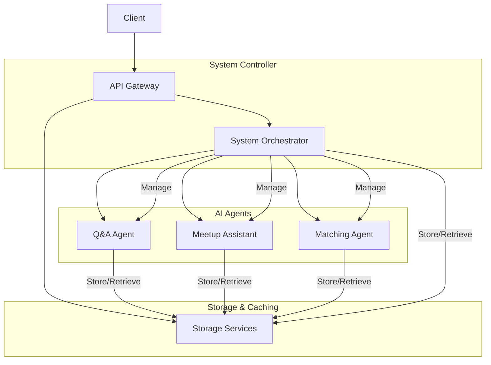

# Magnet AI Engines
#### Streamlit Cloud App [](https://magnet-ai-engines-p6rwddjqq875pjvap72rvh.streamlit.app/)

## 프로젝트 개요
이 저장소는 밋업 매칭 추천 시스템을 포함한 AI 엔진의 구현을 담고 있습니다. 사용자 프로필 기반의 유사도 측정을 통해 최적의 매칭을 추천하고, 이를 시각화하는 도구를 제공합니다. 직관적인 대시보드를 통해 사용자 간 관계를 시각적으로 탐색할 수 있습니다.


## 주요 기능
- **가상 사용자 시뮬레이션**: 테스트를 위한 가상 사용자 생성 및 시뮬레이션
- **QnA 대화 생성**: 사용자 맞춤형 질문 생성
- **밋업 매칭 추천**: 사용자 프로필 기반 유사도 측정 및 추천
- **시각화**: 사용자 중심 네트워크 그래프 시각화

## 핵심 모듈
- `simulation_virtual_users.py`: 가상 사용자 생성 및 시뮬레이션
- `meetup_recommendation.py`: 밋업 매칭 시뮬레이션
- `streamlit_dashboard.py`: 대시보드 및 시각화 인터페이스
- `visualization/`: 시각화 모듈 패키지

## 프로젝트 구조

```
├── architecture_design/   # 아키텍처 설계 문서
├── data/                  # 데이터 파일
│   ├── profiles/          # 사용자 프로필 데이터
│   └── conversations/     # 사용자 대화 데이터
├── cached_data/           # 캐시 데이터 저장소
├── logs/                  # 로그 파일
├── tests/                 # 테스트 코드
├── visualization/         # 시각화 패키지
│   ├── __init__.py        # 패키지 초기화 파일
│   ├── utils.py           # 유틸리티 함수
│   └── network_graphs.py  # 네트워크 그래프 시각화 모듈
├── simulation_virtual_users.py  # 가상 사용자 생성 및 시뮬레이션
├── meetup_recommendation.py     # 밋업 매칭 시뮬레이션
├── question_generation.py       # 질문 생성 엔진
└── streamlit_dashboard.py       # 시각화 대시보드
```

## 시스템 아키텍처

<div align="center">



</div>

## Roadmap

### 구현 완료

- [x] **User Simulation**: 가상 사용자 생성 및 시뮬레이션 구현
- [x] **Q&A Agent**: 질문/답변 생성 기본 기능 구현
- [x] **Matching Agent**: 사용자 매칭 처리 기본 알고리즘 구현
- [x] **대시보드**: 기본 시각화 구현

### 계획 항목
- [ ] **Meetup Assistant**: 밋업 Assistant (Pre-meetup, In-meetup, Post-meetup Assistant) 구현
- [ ] **Storage & Caching**: Redis, PostgreSQL DB 구현
- [ ] **Voice Interface**: 음성 인터페이스 기능 개발
- [ ] **API Gateway**: 클라이언트 API 연동

## 시작하기

### 필요 환경
- Python 3.10+
- 필요 패키지: numpy, pandas, scikit-learn, langchain-google-genai, matplotlib, networkx, plotly

### 설치 방법
```bash
# 저장소 클론
git clone https://github.com/yourusername/magnet-ai-engines.git
cd magnet-ai-engines

# 환경 설정
python -m venv venv
source venv/bin/activate  # Windows: venv\Scripts\activate
pip install -r requirements.txt

# 환경 변수 설정
cp .env.example .env
# .env 파일에 Google AI Studio API 키 입력
```

### 사용 예시
1) 가상 사용자 생성 및 시뮬레이션
```bash
python simulation_virtual_users.py
```

2) 질문 생성 엔진 사용
```bash
python question_generation.py
```

3) 밋업 추천 시스템 사용
```bash
python meetup_recommendation.py
```

4) 매칭 결과 시각화 
```bash
# Streamlit 대시보드 실행
streamlit run streamlit_dashboard.py
```

### 대시보드 기능

1. **사용자 중심 네트워크 시각화**: 선택한 사용자를 중심으로 유사도가 높은 사용자들의 네트워크를 시각화합니다.
2. **인터랙티브 네트워크 그래프**: Plotly를 사용한 인터랙티브 네트워크 그래프로 사용자 간 관계를 탐색할 수 있습니다.
3. **유사도 필터링**: 유사도 임계값을 조정하여 다양한 수준의 연결을 시각화할 수 있습니다.
4. **사용자 선택**: 다양한 사용자를 선택하여 각 사용자 중심의 네트워크를 확인할 수 있습니다.

## 시각화 유형

1. **사용자 중심 네트워크 그래프**: 선택한 사용자를 중심으로 유사도가 높은 사용자들의 네트워크를 시각화합니다.
2. **인터랙티브 사용자 중심 네트워크 그래프**: Plotly를 사용한 인터랙티브 네트워크 그래프로 사용자 간 관계를 탐색할 수 있습니다.
3. **히트맵 시각화**: 사용자 간 유사도를 히트맵으로 시각화하여 전체적인 매칭 패턴을 파악할 수 있습니다.
4. **추천 결과 시각화**: 추천 알고리즘의 결과를 직관적인 차트와 그래프로 시각화합니다.

## 캐시 사용

Streamlit 대시보드는 기본적으로 계산 결과를 캐시하여 성능을 향상시킵니다. 캐시를 초기화하려면 대시보드 사이드바에서 '캐시 강제 초기화' 옵션을 선택하세요.

## 기여하기
프로젝트 기여에 관한 문의는 프로젝트 관리자에게 연락해 주세요.
