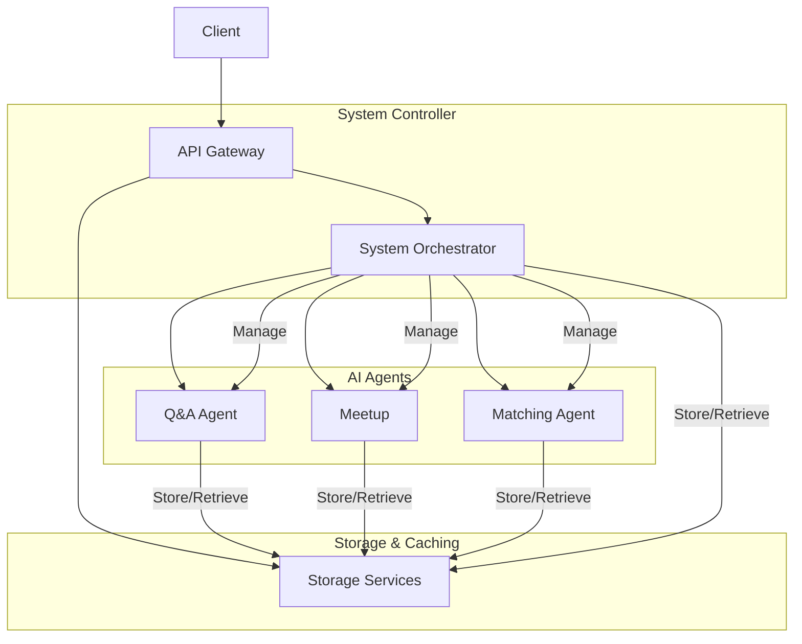

```mermaid
graph TD
    %% 고수준 계층
    A["Client"] --> B["API Gateway"]

    subgraph "System Controller"
        B --> C["System Orchestrator"]
    end

    subgraph "AI Agents"
        C --> D["Q&A Agent"]
        C --> E["Meetup "]
        C --> F["Matching Agent"]
    end

    subgraph "Storage & Caching"
        B --> G["Storage Services"]
    end

    %% 상세 연결
    C -->|Manage| D
    C -->|Manage| E
    C -->|Manage| F
    D -->|Store/Retrieve| G
    E -->|Store/Retrieve| G
    F -->|Store/Retrieve| G
    C -->|Store/Retrieve| G

    %% 주석
    %% - System Controller: 인증, 인프라 오케스트레이션, 모니터링 관리
    %% - Q&A Agent: 질문/답변 생성 (RAG, LLM, 음성, 분석 포함)
    %% - Meetup Facilitation Agent: 밋업 어시스턴트 (밋업 전 주안점 안내, 밋업 중 조언, 만족도 점검, 밋업 후 요약, 이후 밋업 추천 포함)
    %% - Matching Agent: 사용자 매칭 처리
    %% - Storage & Caching: Redis, etcd, PostgreSQL, Network Storage
```