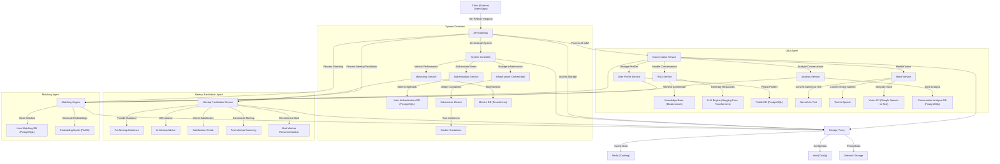

```mermaid
graph TD
    %% 사용자 인터페이스 계층
    A["Client (External Users/Apps)"] -->|HTTP/REST Request| B["API Gateway"]

    %% 컨트롤러 계층 (시스템 개요) - 하위 컴포넌트 서브그래프
    subgraph "System Overview"
        B -->|Orchestrate System| C["System Controller"]
        C -->|Authenticate Users| D["Authentication Service"]
        D -->|Store Credentials| E["User Authentication DB (PostgreSQL)"]
        C -->|Manage Infrastructure| F["Infrastructure Orchestrator"]
        F -->|Deploy Containers| G["Kubernetes Cluster"]
        G -->|Run Containers| H["Docker Containers"]
        C -->|Monitor Performance| I["Monitoring Service"]
        I -->|Store Metrics| J["Metrics DB (Prometheus)"]
    end

    %% 에이전트 계층 (Q&A) - 하위 컴포넌트 서브그래프
    subgraph "Q&A Agent"
        B -->|Process AI Q&A| K["Conversation Service"]
        K -->|Handle Conversations| L["RAG Service"]
        L -->|Retrieve & Generate| M["Knowledge Base (Elasticsearch)"]
        L -->|Generate Responses| N["LLM Engine (Hugging Face Transformers)"]
        K -->|Manage Profiles| O["User Profile Service"]
        O -->|Persist Profiles| P["Profile DB (PostgreSQL)"]
        K -->|Handle Voice| Q["Voice Service"]
        Q -->|Convert Speech to Text| R["Speech-to-Text"]
        Q -->|Convert Text to Speech| S["Text-to-Speech"]
        Q -->|Integrate Voice| T["Voice API (Google Speech-to-Text)"]
        K -->|Analyze Conversations| U["Analysis Service"]
        U -->|Store Analysis| V["Conversation Analysis DB (PostgreSQL)"]
    end

    %% 에이전트 계층 (밋업 퍼실리테이팅) - 하위 컴포넌트 서브그래프
    subgraph "Meetup Facilitation Agent"
        B -->|Process Meetup Facilitation| W["Meetup Facilitation Service"]
        W -->|Provide Guidance| X["Pre-Meetup Guidance"]
        W -->|Offer Advice| Y["In-Meetup Advice"]
        W -->|Check Satisfaction| Z["Satisfaction Check"]
        W -->|Summarize Meetup| AA["Post-Meetup Summary"]
        W -->|Recommend Next| AB["Next Meetup Recommendation"]
    end

    %% 에이전트 계층 (매칭) - 하위 컴포넌트 서브그래프
    subgraph "Matching Agent"
        B -->|Process Matching| AC["Matching Engine"]
        AC -->|Store Matches| AD["User Matching DB (PostgreSQL)"]
        AC -->|Generate Embeddings| AE["Embedding Model (FAISS)"]
    end

    %% 스토리지 및 캐싱 계층
    B -->|Access Storage| AF["Storage Proxy"]
    AF -->|Cache Data| AG["Redis (Caching)"]
    AF -->|Config Data| AH["etcd (Config)"]
    AF -->|Persist Data| AI["Network Storage"]

    %% 데이터 흐름
    O --> AC
    %% User Profile Service가 Matching Engine에 데이터 제공
    U --> AC
    %% Analysis Service가 Matching Engine에 분석 데이터 제공
    K --> AC
    %% Conversation Service가 Matching Engine에 대화 데이터 제공
    I --> W
    %% Monitoring Service가 Meetup Facilitation Service에 메트릭 제공
    C --> AF
    %% System Controller가 Storage Proxy에 데이터 저장/접근
    K --> AF
    %% Q&A Agent가 Storage Proxy에 데이터 저장/접근
    W --> AF
    %% Meetup Facilitation Agent가 Storage Proxy에 데이터 저장/접근
    AC --> AF
    %% Matching Agent가 Storage Proxy에 데이터 저장/접근
```